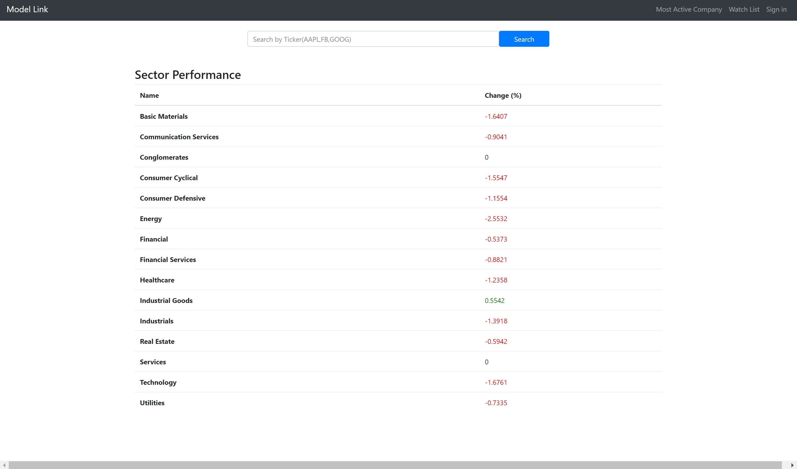
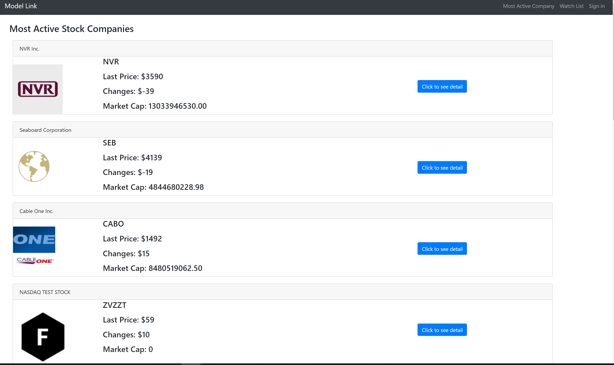
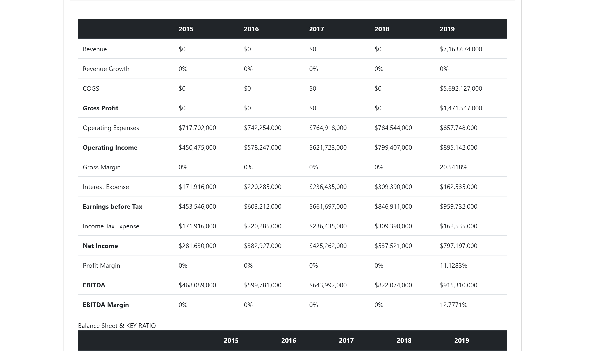

## ModelLink

The Financial models are complicated subject. The project stands for make financial 
models understandable for almost everybody and accessible deliver right data.
 The app provide users with the ability to view financial data in an organized,
 easily-digestible format and to generate an integrated three-statement financial
 model that can be used to make flexible projections

### Technologies 
* API used : Financial Modeling API, News Api
* Javascript
* NodeJS
* CSS
* Bootstrap
* Handlebars
* ExpressJS
* Mysql Database
* Sequelize
* Axios
* Cheerio
* JSON Web Tokens
* D3 Framework for financial charts and formatting


<!-- GETTING STARTED -->
## Getting Started
To get a local copy up and running follow these simple example steps.

### Prerequisites

This is an example of how to list things you need to use the software and how to install them.
* npm
```sh
npm install npm@latest -g
```

### Installation
1. Clone the repo
```sh
git clone git@github.com:squarefozilov/modelLink.git
```
2. Install NPM packages
```sh
npm install
```
## Usage    
* **ModelLink** application in the first page allows user view Stock Market Sector Performances and searching by stock market ticker symbol of the company
*

*
* The user can view Most Active Companies

*
* Showing detailed overview of the company and getting news related to the company by clicking details button
*


## Direction for Future Development
* Ability to export in excel and with formulas
* All 3 financial statements(Income, Balance Sheet, Cash Flow)
* D3 graphs to provide user to visualize data
 
Project Link: [https://still-anchorage-79783.herokuapp.com] (https://github.com/squarefozilov/modelLink)
